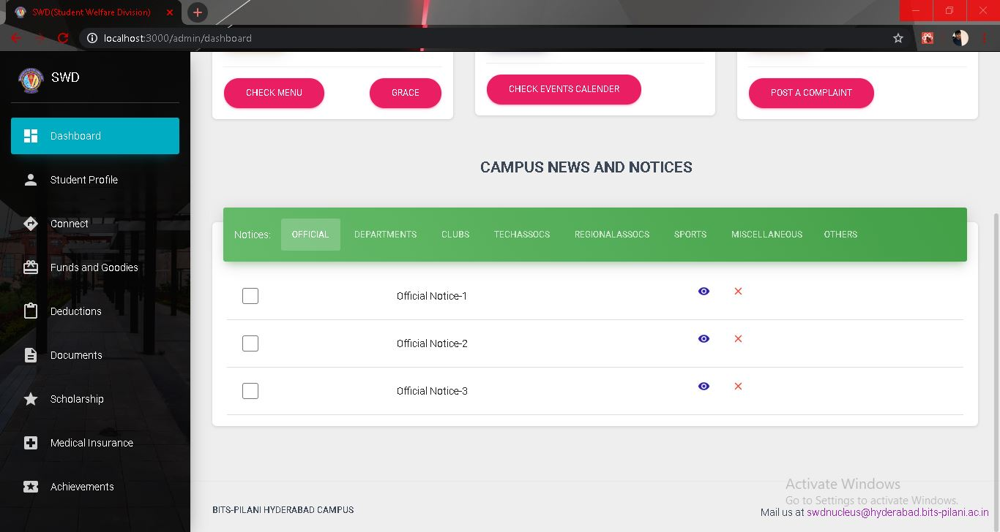

# SWD WEBSITE - FRONTEND 
    
  The current repository holds the entire codebase of frontend of SWD Portal of BITS Pilani,Hyderabad Campus


### **FILE STRUCTURE**
After cloning/downloading you'll find the following directories and files:

```
.
├── jsconfig.json
├── package.json
├── public
│   ├── favicon.ico
│   ├── index.html
│   └── manifest.json
├── README.md
├── src
│   ├── App.js
│   ├── assets
│   │   ├── css
│   │   ├── img
│   │   ├── jss
│   │   └── scss
│   ├── components
│   │   ├── Badge
│   │   ├── Card
│   │   ├── Clearfix
│   │   ├── CustomButtons
│   │   ├── CustomDropdown
│   │   ├── CustomInput
│   │   ├── CustomLinearProgress
│   │   ├── CustomTabs
│   │   ├── Footer
│   │   ├── Grid
│   │   ├── Header
│   │   ├── InfoArea
│   │   ├── Navbars
│   │   ├── NavPills
│   │   ├── Pagination
│   │   ├── Parallax
│   │   ├── Sidebar
│   │   ├── Snackbar
│   │   ├── Table
│   │   ├── Tasks
│   │   └── Typography
│   ├── context
│   │   └── auth.js
│   ├── index.js
│   ├── layouts
│   │   ├── Admin.js
│   │   ├── Official.js
│   │   └── RTL.js
│   ├── logo.svg
│   ├── OfficialPrivateRoute.js
│   ├── OfficialRoutes.js
│   ├── routes.js
│   ├── StudentPrivateRoute.js
│   ├── variables
│   │   ├── BaseUrl.js
│   │   ├── general.js
│   │   └── swdmembers.js
│   └── views
│       ├── Awards
│       ├── Connect
│       ├── Counsellor
│       ├── Dashboard
│       ├── Deductions
│       ├── Documents
│       ├── Faqs
│       ├── Goodies
│       ├── KnowYourDept
│       ├── KYA
│       ├── LandingPage
│       ├── LoginPage
│       ├── MedClaim
│       ├── Modals
│       ├── Official
│       ├── OfficialComponents
│       ├── Outstation
│       ├── ResetPassword
│       ├── Scholarship
│       ├── UserProfile
│       └── VirtualCampus
└── yarn.lock
```
# BASIC OVERVIEW

The website can be specifically divided into two parts
- Student side (Student Portal)
- Official side (Official Portal)
  
### ***Student Side***

The student side uses the `admin.js` layout and all the components associated with student side can be found at `/src/views/`.

### ***Official Side***

The student side uses the `official.js` layout and all the components associated with student side can be found specifically at `/src/views/official` .


# STYLING AND CSS

- This project uses [Material-ui](https://material-ui.com/) React components. The components are customized to specific needs using [@material-ui/styles]([www](https://material-ui.com/styles/basics/)). All the customized components are available at `/src/components`.
All the customized styled CSS are availabel at `/assets/jss/`
- Styles specific to Landing page , Official login page and student login page can be found at `assets/jss/material-kit-react`. 
- Styles for other pages can be found at `assets/jss/material-kit-react` 


# CONTRIBUTION
### Creating PR
- Fork the repository to your own account.
- Clone the forked repo on your own computer and make any changes.
- Push all changes to remote origin 
- Create a pull request.
- Resolve conflicts if any 

### Standard JS package : 
- In order to maintain a standard level of coding style we'll be using standard js package.
- Install Standard JS globally using : 
```
npm install standard --global
```
- Before creating any pull requests always run the command : 
```
npx standard --fix
```
and fix any errors. 
- Know more about [StandardJS](https://standardjs.com/index.html) here.

# Setting up the Environment
### Environment : 
- Install NodeJS on your system
- Enter into the project folder and run the command to install dependencies : 
 ```
 npm install
 ```
 - To start the react app run the following commmand  : 
 ```
 npm start 
 ```
 This will by default start the react project at port *3000*. Ignore the warnings (if any);
 - When installing a new dependancy **always** use : 
 ```
 npm install --save package_name
 ```
 > Always use the --save flag to install any package
 - Always uninstall packages that are no longer in use using the command : 
 ```
 npm uninstall --save package_name
 ```


### Certain things to keep in mind:

- Get your self really familiar with Reactjs to start contributing to this repo.

- Keep in mind the specific styling for the component and don't disturb the global styling space in `/assets/jss/material-kit-react` or `/assets/jss/material-dashboard-react`. Create specific style objects for your components in 
in that folder and use it upto eternity.

- For state management no specific package is used like redux or zustand. Basic React hooks have been utilised for the purpose.

- Beginner Friendly pages to contribute include 
  - Landing page
  - FAQ
  - Know Your Academics
  - And content related pages to get familiar with react

# SCREENSHOTS FROM THE WEBSITE

### **LANDING PAGE**  


<br />

### **STUDENT LOGIN PAGE**  


<br />

### **STUDENT DASHBOARD**  

<br />



<br />

### **STUDENT PROFILE**


<br />

### **CONNECT**


<br />

### **DOCUMENTS**


<br />

<!-- ### **DASHBOARD**
 -->

<br />

### **DEDUCTIONS**

<br />

### **SCHOLARSHIPS**

<br />

### **MEDICAL INSURANCE**

<br />

<!-- ### **DASHBOARD**
 -->


  
